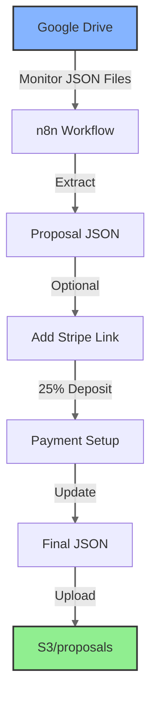
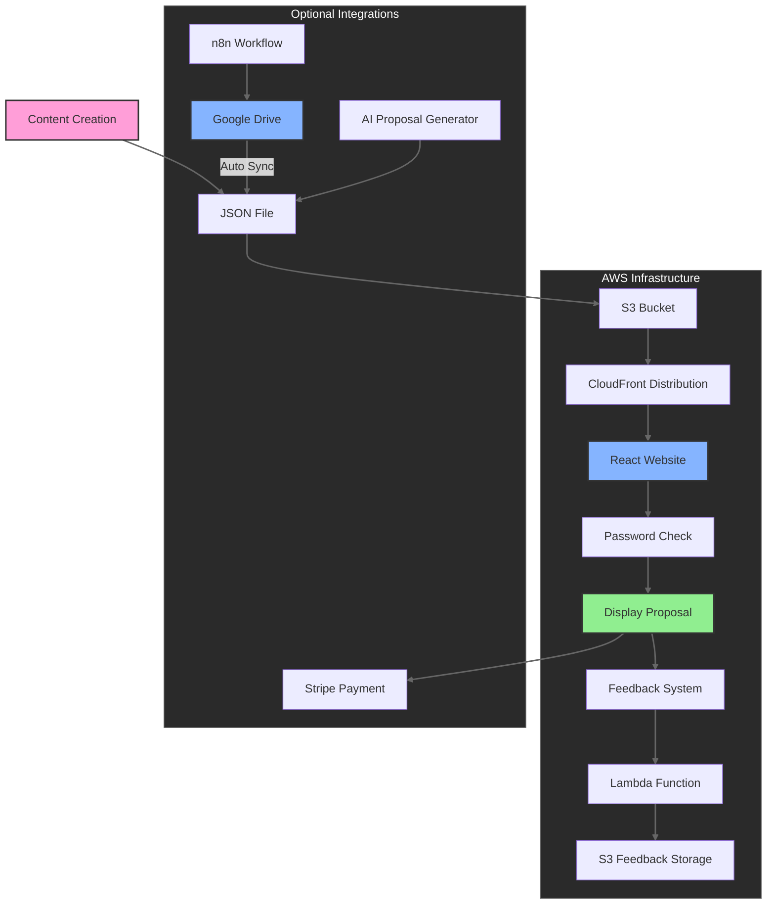

# Proposal Website Generator

[](https://youtu.be/tXKuYGaGHxo "Watch the Tutorial")

Transform your static proposals into dynamic, interactive websites. This tool helps you create modern, password-protected, and always up-to-date proposals using React, AWS, and optional n8n integration.

## 🤖 AI Proposal Generator

Need help creating your proposal content? Visit our [AI Proposal Generator](https://tools.gettingautomated.com/) to:
- Generate proposal content using GPT-4o
- Use our form-based JSON generator
- Export proposal-ready JSON files
- Create first drafts in seconds
- Customize all sections interactively

Cost: ~$0.01-0.02 per proposal with GPT-4o

## 🤝 Join Our Community

Love automation projects like this? Join the [Getting Automated Community](https://gettingautomated.com/community) to:
- Get early access to new automation tools
- Connect with fellow automation enthusiasts
- Share and discover automation recipes
- Learn about the latest AI & automation techniques
- Get support for your automation projects

[Join the waitlist](https://gettingautomated.com/community) to be notified when we launch!

## 🎯 Why Use This?
- **Always Current**: No more outdated PDFs or PowerPoints - your proposal stays fresh
- **Interactive Experience**: Rich media, feedback collection, and direct payment options
- **Professional Polish**: Sleek, responsive design that works on all devices
- **Cost-Effective**: Serverless architecture means hosting costs of ~$1/month
- **Secure Sharing**: Simple password protection and expiration dates
- **Instant Feedback**: Built-in commenting system for stakeholder input
- **Payment Ready**: Optional Stripe integration for collecting deposits

## 🔄 Automated with n8n

This project includes an n8n workflow for automated proposal management. Get the complete workflow from our [detailed guide](http://gettingautomated.com/ditch-powerpoint-create-ai-proposal-sites-with-n8n-in-5-minutes/).



#### What the Workflow Does
- Monitors a Google Drive folder for proposal JSON files
- Automatically processes new and updated files
- Optionally adds Stripe payment links for deposits
- Uploads processed files to your S3 bucket
- Maintains proposal versioning

#### Key Features
- **Automated File Processing**:
  - Watches specific Google Drive folder
  - Handles JSON validation
  - Updates in near real-time (5-minute intervals)

- **Payment Integration** (Optional):
  - Creates Stripe products automatically
  - Generates deposit payment links (configurable %)
  - Embeds payment URLs in proposal JSON

- **AWS Integration**:
  - Direct uploads to your proposal S3 bucket
  - Maintains proper file structure
  - Works with CloudFront distribution

#### Getting Started
1. Visit our [step-by-step guide](http://gettingautomated.com/ditch-powerpoint-create-ai-proposal-sites-with-n8n-in-5-minutes/)
2. Download the production-ready workflow
3. Configure with your:
   - Google Drive credentials
   - AWS S3 access
   - Stripe API keys (if using payments)
4. Start automating your proposal deployments!

## 🚀 Perfect For
- Sales teams tired of static PDFs going stale
- Freelancers managing multiple client proposals
- Agencies needing a scalable proposal system
- Businesses wanting a more professional proposal flow

## 💡 Key Features
- **Dynamic Content**: JSON-based content management
- **Password Protection**: Basic access control per proposal
- **Feedback System**: Section-by-section commenting
- **Payment Integration**: Optional Stripe payment links
- **Rich Media**: Support for videos, images, and interactive elements
- **Mobile Responsive**: Looks great on all devices
- **Analytics Ready**: Track proposal views and engagement
- **Always Up-to-Date**: Single URL that's always current

## 💰 Cost Breakdown
- AWS Hosting: ~$1/month (S3 + CloudFront)
- Optional Integrations:
  - n8n: Free (self-hosted) or minimal monthly fee (cloud)
  - Stripe: Standard transaction fees
  - AI Generation: ~$0.01-0.02 per proposal with GPT-4o

## Architecture

### System Flow



### AWS Services

- **S3**: 
  - Stores proposal content in JSON format
  - Hosts static website assets
  - Separate paths for proposals and feedback
- **CloudFront**: 
  - Serves website content with edge caching
  - Custom domain support with SSL/TLS
  - Origin Access Control (OAC) for S3 security
- **Lambda**: 
  - Handles feedback submission and retrieval
  - CORS-enabled function URL
  - S3 integration for feedback storage
- **ACM**: 
  - SSL/TLS certificate management
  - Automatic DNS validation
- **IAM**: 
  - Granular bucket access policies
  - Lambda execution roles
  - Feedback management user

## 🌟 Features

### Content Management
- **JSON Content Structure**
  - Flexible data schema
  - Version control friendly
  - Content validation
- **Feedback System**
  - Section-based comments
  - Persistent storage

### UI Components
- **Hero Section**
  - Project overview
  - Client details
  - Loom video integration
- **Problem/Solution**
  - Problem statement
  - Solution description
  - Benefits list
  - Impact analysis
- **Feature Showcase**
  - Solution features
  - Benefits
  - Technical details
- **Timeline/Process**
  - Project phases
  - Deliverables
  - Activities
- **Pricing Tables**
  - Project pricing
  - Included features
  - Payment terms
- **FAQ Section**
  - Common questions
  - Detailed answers
- **Contact Integration**
  - Contact details
  - Calendly integration
  - Social media links

### Security Features
- **Basic Protection**
  - Password protection option
  - Expiration dates
  - CloudFront distribution
- **AWS Security**
  - S3 bucket policies
  - CloudFront OAC

## 🚀 Getting Started

### Prerequisites

1. **Node.js Environment**
   - Node.js v16 or higher
   - npm or yarn package manager

2. **AWS Account Setup**
   - AWS CLI installed and configured with admin access
   - Required IAM permissions (Note: These permissions are broad for ease of setup. For production, consider restricting to specific resources and actions needed):
     ```json
     {
       "Version": "2012-10-17",
       "Statement": [
         {
           "Effect": "Allow",
           "Action": [
             "cloudformation:*",
             "s3:*",
             "cloudfront:*",
             "lambda:*",
             "iam:*",
             "acm:*",
             "logs:*",
             "route53:*"
           ],
           "Resource": "*"
         }
       ]
     }
     ```
   - For a more secure production environment, consider:
     - Limiting resources to specific ARNs
     - Restricting actions to only those needed
     - Using separate deployment and runtime roles
     - Following the principle of least privilege
   - Domain name you control (for SSL certificate validation)
   - Ability to update DNS records for your domain
   - AWS Region with ACM certificate support (us-east-1 recommended)

3. **Domain Requirements**
   - Registered domain name
   - Ability to add/modify DNS records
   - If using Route 53:
     - Domain should be in Route 53
     - Additional permission: `route53:ListHostedZones`
   - If using another DNS provider:
     - Access to add CNAME records for ACM validation
     - Access to add CNAME record for CloudFront distribution

### Installation

1. **Repository Setup**
```bash
# Clone repository
git clone https://github.com/yourusername/proposal-website-generator.git
cd proposal-website-generator

# Install dependencies
npm install
```

2. **AWS Infrastructure Setup**
```bash
# Configure AWS deployment
cd provision_aws
cp .env.sample .env

# Update .env with your settings
DOMAIN_NAME="proposals.yourdomain.com"
COMPANY_NAME="Your Company"
REGION="us-east-1"
ENVIRONMENT="prod"

# Deploy AWS infrastructure
./provision.sh
```

3. **Environment Configuration**
```bash
# Create environment file
cp .env.example .env

# Configure .env (values provided by provision.sh)
VITE_CLOUDFRONT_URL=https://your-cloudfront-url.net
VITE_AWS_BUCKET_NAME=your-bucket-name
VITE_FEEDBACK_URL=https://your-lambda-url.lambda-url.region.on.aws/
```

## 🔐 Security Implementation

### AWS Security

1. **S3 Bucket Security**
   - CloudFront Origin Access Control (OAC)
   - Bucket policies for specific paths
   - Public access blocked
   - CORS configuration for API access

2. **CloudFront Configuration**
   - HTTPS-only access
   - Custom SSL/TLS certificate
   - Cache behaviors for different paths
   - Origin access restrictions

3. **Lambda Security**
   - Function URL with CORS
   - IAM execution role
   - Limited S3 permissions
   - Request origin validation

4. **Content Protection**
   - Optional password protection
   - Expiration dates
   - Proposal-specific access control

### Content Access

1. **Proposals**
   - Served via CloudFront
   - JSON files in S3
   - Optional password protection
   - Expiration date checks

2. **Feedback System**
   - Lambda function URL endpoint
   - S3 storage in feedback/
   - Origin validation
   - Error handling

## 📝 Development

### Local Development
```bash
# Start development server
npm run dev

# Build for production
npm run build

# Preview production build
npm run preview
```

### Deployment
```bash
# Deploy infrastructure changes
cd provision_aws
./provision.sh

# Deploy website updates
npm run build
# (provision.sh handles the S3 upload and CloudFront invalidation)
```

## 📁 Project Structure

```
├── src/
│   ├── components/          # React components
│   │   ├── Hero/           # Hero section
│   │   ├── Problem/        # Problem statement
│   │   ├── Solution/       # Solution details
│   │   └── ...            # Other components
│   ├── types/              # TypeScript types
│   ├── utils/              # Utility functions
│   │   ├── proposal.ts     # Proposal loading
│   │   └── feedback.ts     # Feedback handling
│   └── context/            # React context
├── public/                 # Static assets
└── .env                    # Environment variables
```

## 🛠 Usage Guide

### Creating New Proposals

1. Create a JSON file with your proposal content following the ContentType interface
2. Upload the JSON file to your S3 bucket
3. Access the proposal at `yourdomain.com/proposal-id`

### Content Structure

Your proposal JSON should include:
- Client information
- Project details
- Problem statement
- Solution description
- Technical architecture
- Process and timeline
- Pricing details
- FAQ
- Contact information

### Optional Features

1. **Password Protection**
   - Add a password field to your JSON
   - Users will need to enter the password to view

2. **Expiration Date**
   - Add an expirationDate field
   - Proposal becomes inaccessible after date

3. **Feedback Collection**
   - Users can leave feedback on each section
   - Feedback stored via Lambda function

## 🔐 Security Considerations

1. **Content Access**
   - CloudFront distribution protects S3 content
   - Optional password protection
   - Expiration dates

2. **Password Protection Limitations**
   - The password protection is implemented client-side and is intended for basic access control only
   - The password is stored in plain text in the proposal JSON
   - Not suitable for highly sensitive information
   - Can be supplemented with:
     - AWS Cognito for user authentication
     - AWS WAF for additional security rules
     - IP-based restrictions via CloudFront
     - Custom Lambda@Edge authentication

3. **AWS Configuration**
   - S3 bucket configured for CloudFront access only
   - Lambda function URL with CORS settings
   - Proper IAM roles and policies

## 📄 License

This project is licensed under the MIT License - see the LICENSE file for details.

## 🔄 Updates & Maintenance

### Version History
- v1.0.0 - Initial release

### Roadmap
- [ ] Analytics integration
- [ ] Custom themes
